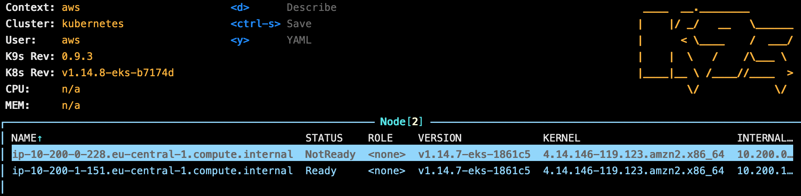

# Amazon Web Services EKS

> _Kubernetes Cloud Provider experiments using Terraform_

The AWS setup is (by far) the most complex setup in this repo. Not only
is Terraform lacking any high level resources, also the control plane
creation takes staggering 10+ minutes.

## Prerequisites

```
brew install aws-iam-authenticator
```

```
[...]
aws_eks_cluster.k8s-demo: Still creating... [10m30s elapsed]
aws_eks_cluster.k8s-demo: Still creating... [10m40s elapsed]
aws_eks_cluster.k8s-demo: Creation complete after 10m42s [id=cloud-k8s-demo]
local_file.foo: Creating...
local_file.foo: Creation complete after 0s [id=661a245b66b123613f711a075b6c6c45a19c8f94]

Apply complete! Resources: 14 added, 0 changed, 0 destroyed.
```


