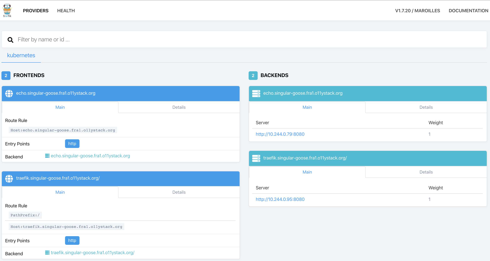

# Kubernetes ❤️ Digital Ocean (DO)

> _Kubernetes in the clouds: experiments using Terraform_

This example will create a Kubernetes cluster with a recent version,
three worker nodes and expose it via a Traefik ingress controller to
the internet.

## Setting up Digital Ocean as provider

[Digital Ocean](https://m.do.co/c/cc570ae1a34b) ships it's own 
command line tool `doctl` to interact with the API. 

```
brew install doctl
```

Before you can use it, you need to [generate an API token](https://cloud.digitalocean.com/account/api/tokens) 
and configure the command line tool:

```
doctl auth init
```

Then use it to explore the exact slugs for Kubernetes versions, regions 
and machine sizes:

```
$ doctl kubernetes options versions
Slug            Kubernetes Version
1.15.5-do.0     1.15.5
[...]

$ doctl compute region list        
Slug    Name               Available
[...]
ams3    Amsterdam 3        true
fra1    Frankfurt 1        true

$ doctl compute size list
Slug              Memory    VCPUs    Disk    Price Monthly    Price Hourly
[...]
s-4vcpu-8gb       8192      4        160     40.00            0.059520
g-2vcpu-8gb       8192      2        25      60.00            0.089286
gd-2vcpu-8gb      8192      2        50      65.00            0.096726 
[...]
```

## Creating the cluster

Then, spinning up the cluster is straight forward. But it still takes about
5 minutes to have control plane and worker up and running.

```
$ terraform init
$ terraform apply
[...]
Apply complete! Resources: 1 added, 1 changed, 1 destroyed.

Outputs:

KUBECONFIG = /Users/torsten/.kube/kube-config-singular-goose
```

### Managing Ingress

The Kubernetes cluster created gets assigned a [random pet name](https://www.terraform.io/docs/providers/random/r/pet.html).
The cluster and it's services should be reachable via it's name in the `fra1.o11ystack.org` 
domain.

The easiest way to create a ingress with an external public ip address is spinning up
a Kubernetes service type `LoadBalancer`. The service will be mapped to a Digital Ocean
Load Balancer that _will remain unmanaged_. In order to add it to Terraform lifecycle 
control, _we'll explicity create it ourselves_.

The DO Load Balancer can not issue _Let's Encrypt wildcard certs_, so we'll have to manage
them via Terraform. We set up the LoadBalancer as HTTP (not TCP) load balancer in order
to retain the original client ip.

Traefik is exposed via `NodePort`. The DO load balancer terminates TLS traffic.



### Connecting to the cluster

The cluster _Kubeconfig_ is written to `~/.kube/kube-config-<CLUSTERNAME>`. Point the 
`KUBECONFIG` environment to it and use it in your _kubectl_ and/or _k9s_ installation.
As an alternative you can use `doctl` to create a [_Kubeconfig_ pointing to the cluster](https://www.digitalocean.com/docs/kubernetes/how-to/connect-to-cluster/).

```
$ export KUBECONFIG=~/.kube/kube-config-singular-goose
$ kubectl get nodes
NAME                  STATUS   ROLES    AGE     VERSION
singular-goose-pool-gkzf   Ready    <none>   4m54s   v1.15.5
singular-goose-pool-gkzx   Ready    <none>   5m20s   v1.15.5
singular-goose-pool-gkzy   Ready    <none>   5m21s   v1.15.5
```


### Adjusting to your needs

Using your DO account and your domain, the only thing to change is the `tld` variable.

## Overall rating

The Kubernetes experience at Digital Ocean is simplistic but great. The cluster created
is as raw as I would expect it in a on premise environment. A big plus is that DO is 
always one or two minor versions of Kubernetes ahead of other providers. Clusters scale
easily using droplets, you pay for the worker nodes only and the load balancers integrate
nicely.

The overall launch time of the control plane are decreasing though from ~4 to ~8 minutes.
As stated above, the correct integration of load balancer into Kubernetes using a wildcard
Let's Encrypt certificate had more manual steps than I'd expect from Digital Ocean.

For small to medium sized projects that do not need fine grained access control (IAM / 
security groups), I'd highly recommend Digital Ocean as Kubernetes cloud
provider.
