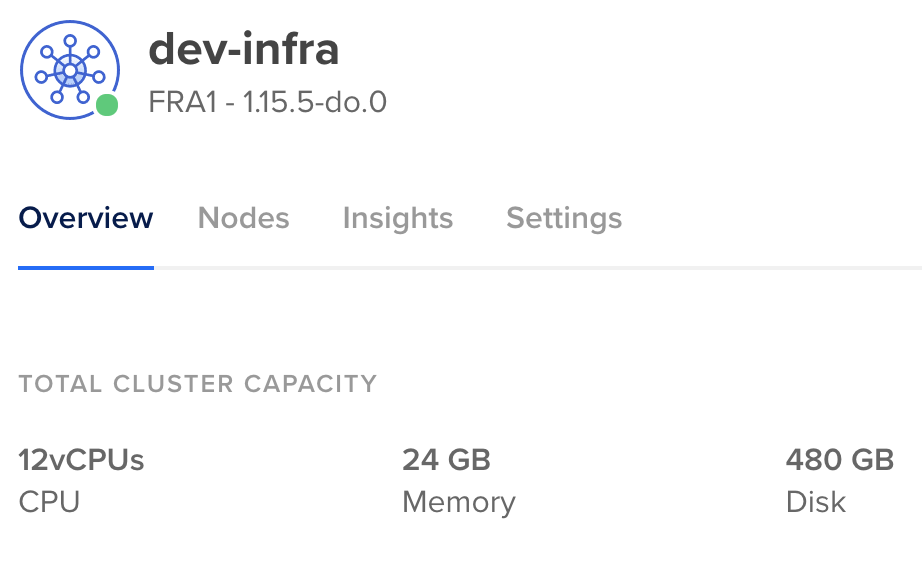

# Digital Ocean (DO)

> _Kubernetes Cloud Provider experiments using Terraform_

DO ships it's own command line tool to interact with the API. 

```
brew install doctl
```

Use it to explore the exact slugs for Kubernetes versions, regions and machine sizes

```
$ doctl kubernetes options versions
Slug            Kubernetes Version
1.15.5-do.0     1.15.5
[...]

$ doctl compute region list        
Slug    Name               Available
[...]
ams3    Amsterdam 3        true
fra1    Frankfurt 1        true

$ doctl compute size list
Slug              Memory    VCPUs    Disk    Price Monthly    Price Hourly
[...]
s-4vcpu-8gb       8192      4        160     40.00            0.059520
g-2vcpu-8gb       8192      2        25      60.00            0.089286
gd-2vcpu-8gb      8192      2        50      65.00            0.096726 
[...]
```

Then, spinning up the cluster is straight forward. But it still takes about
5 minutes to have control plane and worker up and running.

```
$ tf init
$ tf plan
$ tf apply
[...]
digitalocean_kubernetes_cluster.dev-infra: Creation complete after 5m2s [id=56bcb664-e70f-421a-8300-91bb6a153435]

Apply complete! Resources: 1 added, 0 changed, 0 destroyed.
```

## Connecting to the cluster

[Connections to the cluster](https://www.digitalocean.com/docs/kubernetes/how-to/connect-to-cluster/) are managed via `doctl`. Each team member needs to have a
DO account and a API key respectively. From there, things are dope straight forward:

```
$ doctl kubernetes cluster kubeconfig save dev-infra
Notice: adding cluster credentials to kubeconfig file found in "/Users/torsten/.kube/config"
Notice: setting current-context to do-fra1-dev-infra

$ kubectl get nodes
NAME                  STATUS   ROLES    AGE     VERSION
dev-infra-pool-gkzf   Ready    <none>   4m54s   v1.15.5
dev-infra-pool-gkzx   Ready    <none>   5m20s   v1.15.5
dev-infra-pool-gkzy   Ready    <none>   5m21s   v1.15.5
```



## Destroying things

```
tf destroy
```