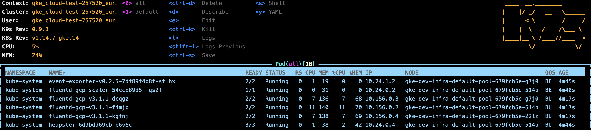

# Google Compute Platform
> _Kubernetes Cloud Provider experiments using Terraform_

Running a cluster in GCP feels a lot more enterprisey than e.g. DO does. As
soon as you have your [project, IAM roles](https://medium.com/@timhberry/learn-terraform-by-deploying-a-google-kubernetes-engine-cluster-a29071d9a6c2) and [client configuration](http://www.how-hard-can-it.be/when-gke-tells-your-terraform-service-account-to-go-away/) in place, things run smoothly.

Google provides the `gcloud` cli tool, which we will use to lookup exact slug names,
versions and creating authentication information.

```
$ brew cask install google-cloud-sdk
```

We do not authenticate our root user, we generate a service account named `terraform`
and authenticate using the downloaded keys:

```
$ gcloud auth activate-service-account terraform@cloud-test-257520.iam.gserviceaccount.com --key-file=credentials/serviceaccount-terraform-cloud-test.json --project=cloud-test-257520
$ gcloud config set project cloud-test-257520
Updated property [core/project].
WARNING: You do not appear to have access to project [cloud-test-257520] or it does not exist.
```

That last warning is oddly wrong. We continue evaluating the most recent
version of Kubernetes we can spin up in our compute zone.

```
$ gcloud container get-server-config --zone europe-west3
Fetching server config for europe-west3
defaultClusterVersion: 1.13.11-gke.9
defaultImageType: COS
validImageTypes:
- UBUNTU
- COS_CONTAINERD
- UBUNTU_CONTAINERD
- COS
validMasterVersions:
- 1.14.7-gke.14
- 1.14.7-gke.10
- 1.13.11-gke.9
[...]
validNodeVersions:
- 1.14.7-gke.14
- 1.14.7-gke.10
[...]
```

Creating the cluster needs about 3 minutes to be up and running. As with Digital Ocean,
your only billed for the worker nodes you utilize.

```
tf apply
[...]
google_container_cluster.dev-infra: Creating...
google_container_cluster.dev-infra: Still creating... [10s elapsed]
google_container_cluster.dev-infra: Still creating... [20s elapsed]
[...]
google_container_cluster.dev-infra: Still creating... [2m50s elapsed]
google_container_cluster.dev-infra: Creation complete after 2m59s [id=dev-infra]
```

We verify that the cluster is running using the `gcloud` utility.
```
gcloud container clusters list             
NAME       LOCATION        MASTER_VERSION  MASTER_IP       MACHINE_TYPE   NODE_VERSION   NUM_NODES  STATUS
dev-infra  europe-west3-b  1.14.7-gke.14   35.242.200.219  n1-standard-1  1.14.7-gke.14  3          RUNNING
```

Next, we use the `gcloud` utility to acquire credentials for our newly 
created cluster.
```
gcloud container clusters get-credentials dev-infra --zone=europe-west3-b
Fetching cluster endpoint and auth data.
kubeconfig entry generated for dev-infra
```

Now we have admin access to our cluster.

```
kubectl get nodes
NAME                                       STATUS   ROLES    AGE     VERSION
gke-dev-infra-default-pool-679fcb5e-22lz   Ready    <none>   3m31s   v1.14.7-gke.14
gke-dev-infra-default-pool-679fcb5e-514b   Ready    <none>   3m33s   v1.14.7-gke.14
gke-dev-infra-default-pool-679fcb5e-g7j0   Ready    <none>   3m31s   v1.14.7-gke.14
```

You can now launch `k9s`, your favorite Kubernetes navigator in your terminal. 
A look at the all pods view reveals a lot of pre-installed components.

